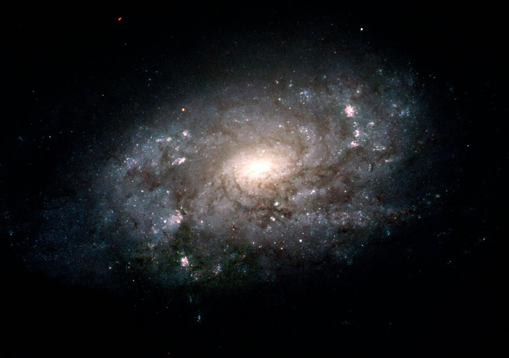

# AC 209B Final Project: Measuring Galaxies

### Spring 2020, Group 2:
- Kaela Nelson
- Kyra Ballard
- Lauren Baker

## Overview
Most galaxies can be adequately modeled as a fuzzy blob with some size, shape, and brightness parameters. Understanding these morphology parameters can provide a deeper understanding of the Universe. For example, size and shape of galaxies can tell us about the Universe's mass distribution and their brightness can tell us about the Universe's origin and evolution. Standard parametric modeling techniques that have been used previously are limited in their generalizability to all galaxies, motivating the need for using deep convolutional neural networks for more robust estimates of galaxy morphology $^ 1$. 

GalSim is an open-source software for simulating images of galaxies $^ 2$. GalSim can generate mock images as a function of brightness and shape parameters. Specific parameters that are of interest to this project are: 
- flux (brightness)
- Sersic index and radius (shape)
- g1 and g2 (shear, or shape distortion)

Images generated from GalSim can include noise to better represent night sky noise and can include point-spread function smoothing to give galaxies the fuzzy blob effect.

## Project Goals
- Train a CNN on Jun's 18,000+ galaxy images generated using GalSim to estimate 5 morphology parameters: flux, Sersic index, Sersic radius, g1, and g2
- Assess model performance on a test set of simulated images by comparing our model's prediction error of each parameter to the Cramér-Rao bound (CRB) and Jun's CAE prediction error for signal-to-noise (SNR) ratios of 30 and 60.

## Table of Contents
1. [Exploratory Data Analysis](/WriteUp/EDA.md)
2. [Baseline Model](/WriteUp/baseline_cnn.md)
3. [Unet Model](/WriteUp/Unet_model.md)
4. [Predictions on Simulated Data](/WriteUp/Sim_data_preds.md)
5. [Conclusion](/WriteUp/conclusion.md)
