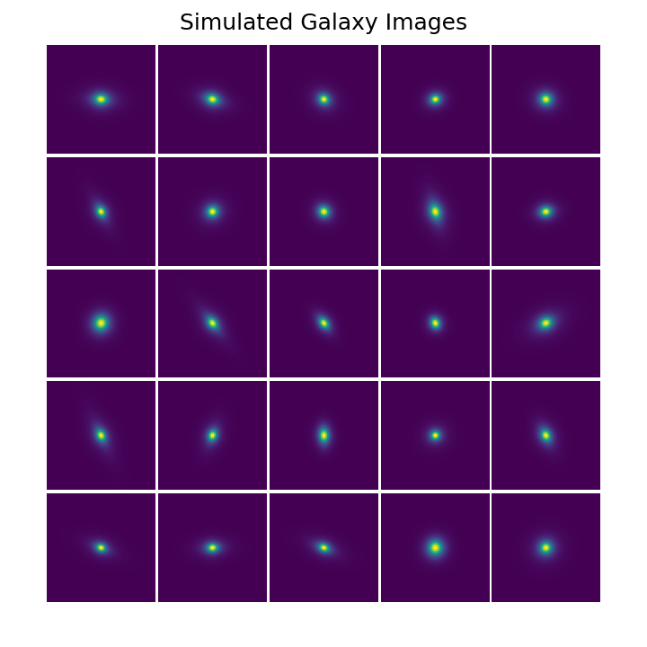
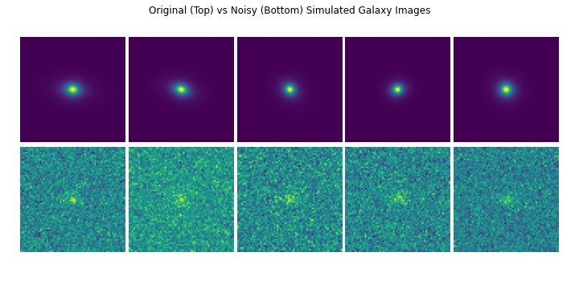

## Exploratory Data Analysis

In our preliminary data analysis, we used the given data file of simulated data to visualize several galaxy images. 

From these subplots, we can see there is some variation in orientation, shape, size, and brightness level. Some images are harder to distinguish from each other (i.e. it is harder to see with the human eye), but neural networks should be able to detect these differences with great precision.

We then explored how the data is generated by GalSim to understand which parameters and considerations will be important when generating additional simulated data and developing our galaxy classification model. The Sérsic profile is represented in GalSim by the Sersic class, and the size can be specified using either the scale radius or the half-light radius. In this simulated dataset, the half light radius was used, which was randomly generated from a uniform distribution from 0.1 to 0.6. According to GalSim documentation, the index n parameter can range from 0.3, below which there are numerical problems, to 6.2, above which rendering inaccuracy may exceed the requirements set for GalSim <a id="note2" href="#note2ref">2</a>. In this case, n was chosen randomly from a uniform distribution between 0.5 and 6.

Flux and shear are parameters that can be added to this Sersic model using the withFlux class and shear class, respectively. Flux is used to describe the surface brightness of galaxies, and shear is used to represent angular distortions from the lensing. For this dataset, the input to withFlux was randomly chosen from a uniform distribution between 0.3 and 4. The two inputs to the shear class were reparameterizations of the galaxy orientation parameter, beta, which was randomly chosen from a uniform distribution from 0 to pi.
GalSim can generate point spread functions (PSFs) from a variety of simple parametric models, such as Moffat used in this simulated dataset. There is a Moffat class in GalSim, which takes as parameters beta, flux and fwhm (full-width-half-max of the profile). In this dataset, beta was chosen as 2, flux as 1, and fwhm from random uniform distribution from 0.5 to 1. The data generated from Sersic is then convolved with the PSF (extended blob that represents a single point object) to create ?galaxy? data that can be transformed to a final image using the GalSim ImageF and drawImage classes. 

Noise can be added to the image using the addNoise class. In this dataset, noise was generated from a Poisson distribution (Poisson Noise class in GalSim) but adding Gaussian noise is also possible. We plotted galaxy images with and without noise to visualize differences below.

 It will be important to utilize the addNoise feature when generating images to be used in training our neural network because this will enable our network to more accurately estimate galaxy properties from noisy background.

<a id="note1" href="#note1ref">1</a>[zhu et al](https://doi.org/10.1007/s10509-019-3540-1)
<a id="note2" href="#note2ref">2</a>[rowe et al](https://doi.org/10.1016/j.ascom.2015.02.002)