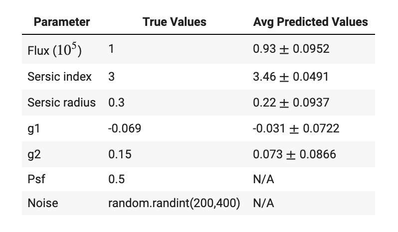

## Predicting on 200 Simulated images

We simulated 200 images using the simulation code provided at the beginning of the notebook. We hold all parameters constant (see values below) and vary the noise. The parameters that are held constant are as follows:

- Psf = 0.5        
- Flux = 1e5*1 
- Sersic radius = 0.3   
- Sersic index = 3 
- g1 = -0.069 
- g2 = 0.15 
- Noise = random.randint(200,400)

### Results

We see that the unet model predicted values that were very close to the true values. This is quite impressive, given that the model has not "seen" these simulated images before. Note the very small standard deviations across parameters, indicating that predictions were not as consistent. 

Because we fixed these 5 parameters, this was a simple case of the model performing well. To extend further past this project, we would simulate more galaxy images, varying more parameters in order to test the robustness of our model.
