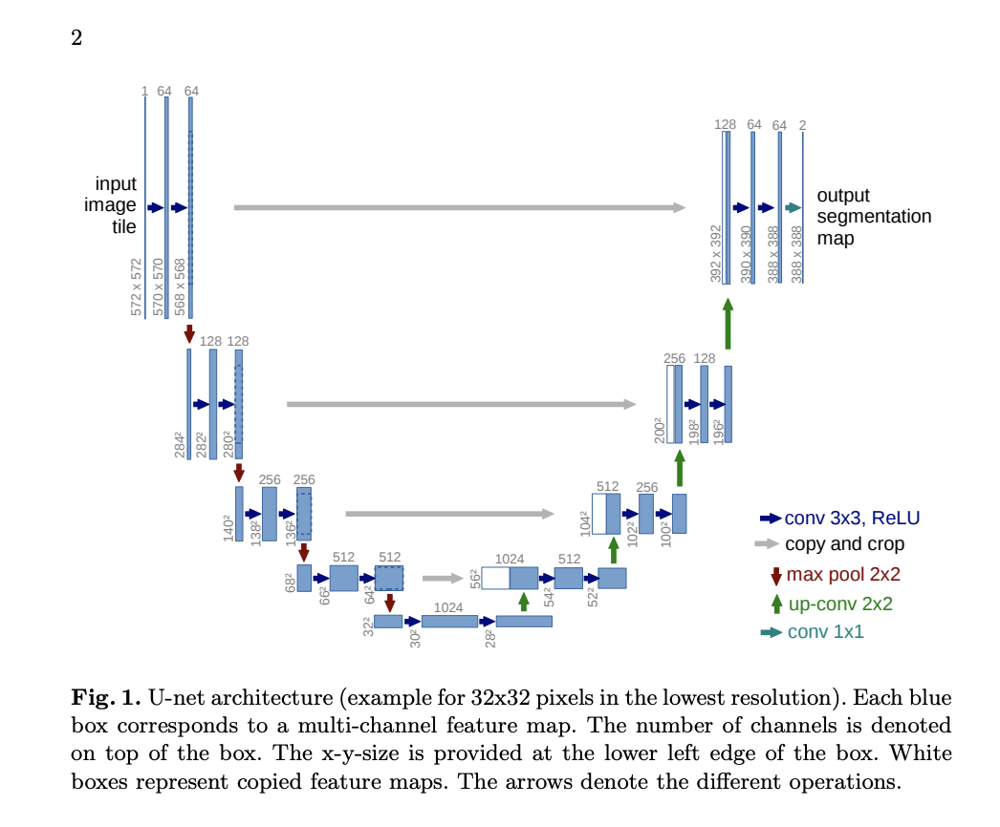
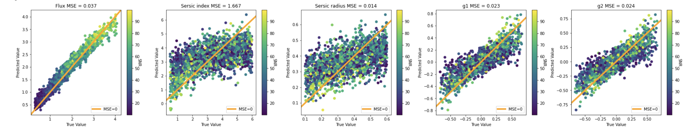
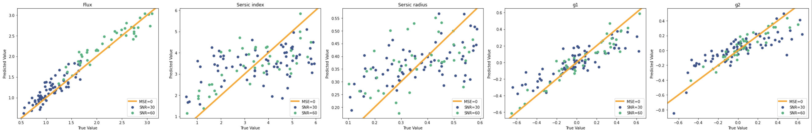
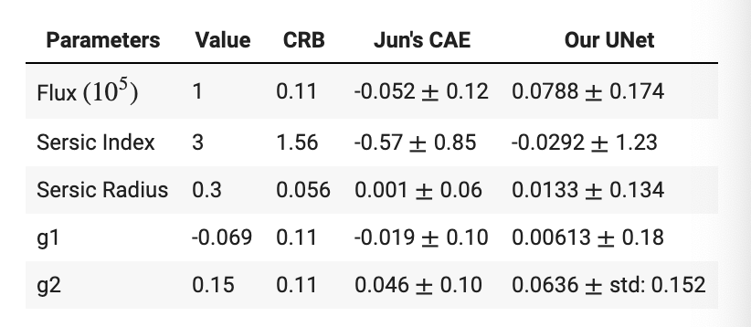
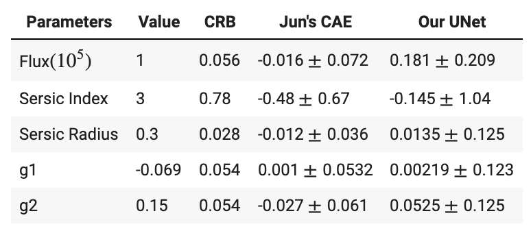

## Unet Model

### Motivation
The Unet model was initially created for image segmentation problems, where it outputs a complete high resolution image in which all the pixels are classified. We can tailor the unet model to categorizing galaxies, as it learns the ?what? info, or galaxy parameters, and captures the ?where? info, or the shape, orientation, and centering of the galaxies. 

This is the unet model architecture from the original paper<a id="note1" href="#note1ref">1</a>. The Structure is similar to autoencoder, where it has an encoder and decoder. In the encoder the Image size reduces as depth increases. In the Decoder, the image size increases as depth increases. It also includes skip connections by combining output of feature maps from Encoder convolution layers at same level. We make modifications by flattening the last convolution layer and adding a dense layer to output our 5 learned parameters. We also added batch normalization layers to the encoder, and compiled the model with a learning rate scheduler.

### Prediction Results

We observe from the plots below that the flux predictions are very good (low mse and low variance around the mse=0 line). The Sersic index and radius both have more variation, however, it looks like the model is learning their pattern decently well given we knew these parameters were the hardest to learn. Lastly the g1 and g2 predicted values are also decent, as they are surrounding the zero error line, yet not as low variance as flux. Although there is definitely prediction error present in all parameters, we would conclude this model was able to predict these parameters reasonably well on this noisy test data set. The architecture of the unet model enabled much more consistent predictions than the basic CNN model, as we saw data relationships very similar to this upon repeated runs of the notebook. We feel that this model is therefore reasonably robust.

#### Breakdown by SNR

We also visualized the simulated galaxy images with SNR=30 and SNR=60. To obtain this data set, we subsetted the data for images with snr between 29-31 for SNR=30, and between 59-61 for SNR=60. We chose those bounds to have more data to visualize, as opposed to only looking at data strictly at SNR=30 or 60. We plot these subsets below.

We can see from the plots above that the images with SNR close to 30 and 60 have rather accurate predictions, as they remain close to the mse=0 line. Notice that the flux values are lower for SNR=30, and higher for SNR=60 galaxies - we can see a nice clustering in this plot. The other parameters do not have this same clustering pattern. Sersic index and sersic radius have more variation, which is expected due to our initial observations.

##### SNR = 30

We evaluate our model's performance by comparing our predictions' mean error for the subset of galaxy images with SNR=30 to that of the Cramer-Rao bound (CRB) and Jun's convolutional autoencoder model (CAE). We can see that our model has relatively low mean error and performs well, as they are relatively close in value to the Jun's and CRB. The Sersic index has the highest standard deviation which would follow the variability we saw in the plot. 

##### SNR = 60

We perform the same analysis with SNR=60. We can see that our model has relatively low mean error and performs well, as they are relatively close in value to the CRB. The Sersic index has the highest standard deviation which would follow the variability we saw in the plot.

<a id="note1" href="#note1ref">1</a>[Ronneberger et al](https://arxiv.org/pdf/1505.04597.pdf)