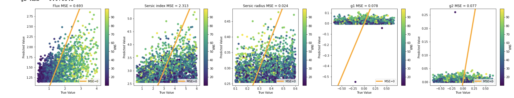

## Baseline Convolution Neural Network Model

### Motivation

Following the exploratory data analysis with the 18,000 images that Jun created, we built a baseline Model with this architecture. Our Goal was to build a baseline model that can learn parameters of simulated images. We could then evaluate and visualize model performance, and observe which parameters are easier or harder to learn.

We first build a baseline model that can learn parameters of simulated images. The goals for this model are to learn parameters of the simulated images. We can then evaluate and visualize model performance, and observe which parameters are easier or harder to learn.

Baseline CNN Architecture:
- 2 conv layers with 16 filters and relu activation 
- max pool layer
- 2 conv layers iwth 32 filters and relu activation 
- max pool layer
- flatten layer
- 1 dense layer with relu activation 
- 1 dense output layer with linear activation 

### Prediction Results

The plots below represent the predicted vs true parameter values, where the orange line indicates perfect predictions, and the color bar represents  SNR.

From this, we see that the model is starting to learn the Flux pattern, but predictions can be improved. The Sersic index and radius are hard to predict, as there is large variance. The G1 and g2 values all  remain around 0 without much variation which implies the baseline model is not learning these parameters very well. Although our baseline CNN achieves low mean squared error for most of the parameters, it is not learning the pattern of the data well enough.
